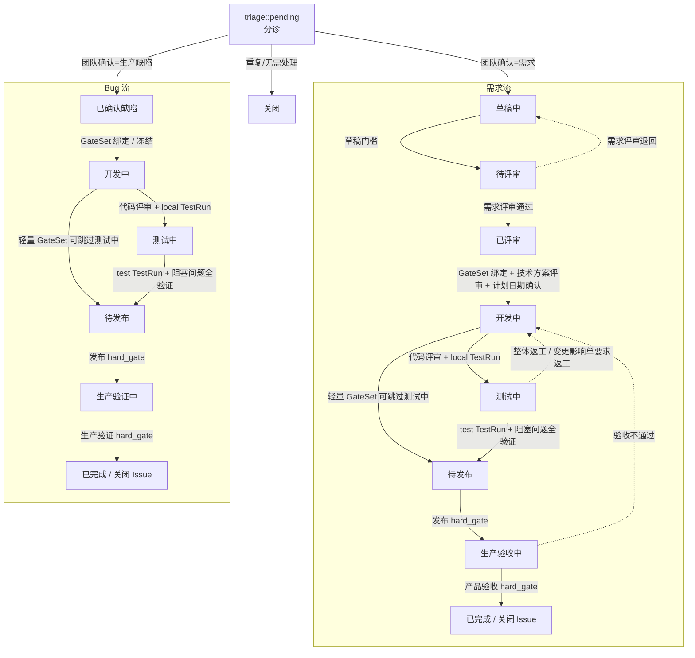

# glab-flow

> 让 AI 推进需求，不绕过交付流程。先看 [项目介绍页](index.html) 了解完整流程、变更闭环与多环境证据链。

glab-flow 是由人主导的 Claude Code / Codex 技能包，依据项目级 GitLab Issue 状态机推进需求：从分诊到发布、验收，以**确定性护栏**约束流程，复用子技能生成内容，并以“预览—确认”方式写回 GitLab。确认行为由**动作分层**（L1 无业务 gate 自动执行 / L2 业务 gate 一次批量确认 / L3 hard_gate 恒人工）决定；每个需求带一份**交付工作包 DU**（`.glab-flow/<iid>/du.json`，承载执行明细、资源登记与指标）；已评审→开发中 按技术方案声明维度推导 **GateSet**（跳状态投影 / 环境集 / MR 评审 / 回归范围），变化经 `change` 定级 T1–T4 并棘轮扩容门禁。

它是自包含、GitLab 原生的技能包，内置配置、状态缓存和随仓库维护的子技能。

## 架构（纯引擎 + Leader 负责 I/O）

- **引擎**（`engine/`，有 TypeScript 测试）：确定性的**纯计算**核心——状态机模型、护栏校验器（G1–G16）、评论渲染器和写回计划构建器。**不启动子进程、不访问网络、不调用 GitLab 客户端**，只接受标准输入并输出标准输出。
- **技能包**（`skills/glab-flow/SKILL.md` + `agents/*.md`）：由 Leader 编排，直接通过 `glab` CLI 读写 GitLab，调用引擎 CLI 作确定性决策，委托专家 Agent，预览、确认后再应用写回。

共七层：触发 → 规则权威（Harness）→ 状态机驱动 → 确定性护栏/预检 → 内容生成（专家 Agent）→ GitLab 集成（Leader 经 `glab` 预览确认）→ 持久化（GitLab Issue 是事实源）。

## 完整流程总览



关键规则：

- GitLab labels 是对外状态投影；DU 是执行事实、GateSet、资源、指标和 `cachedNode` 的主档；state 只是本地派生缓存。
- 每次写回前先读 GitLab + DU 并 `reconcile`；写回顺序固定为 metadata → state-comment → close（终态）→ readback。
- `已评审→开发中` 与 Bug `已确认缺陷→开发中` 是 GateSet 绑定边界；绑定后才能按门禁推进。
- 需求评审不是只挑错：理解真实诉求并补齐追问后，可以把更优方案或交互优化反馈给提单人；采纳才同步到需求/设计/测试策略，不采纳或暂缓不阻塞通过。
- `local` / `test` 都通过 TestRun 证明；glab-flow 内置测试入口是项目脚本、fixture/seed、数据库回读和 E2E，不再要求外部测试平台资产。
- 测试执行前必须先做 E0 数据准备检查：seed/fixture、数据库引用、账号、数据前缀、真实命名和保留/升级策略不齐，不进入执行。
- `proposal.md` / `design.md` / `test-plan.md` 是同一条交付链路：目标与 AC → 设计决策与风险 → case、环境、数据和证据。文档质量标准见 [skills/glab-flow/artifact-quality.md](skills/glab-flow/artifact-quality.md)，不接受只有需求复述、文件清单或临场测试说明的低质量产物。
- 生产发布和终态验收是 hard_gate，必须人工确认；不会用 MR 合并提交或部署版本号替代发布/验证事实。

更完整的流程图、Leader 编排图和证据链见 [docs/flow.md](docs/flow.md)。

## 状态流转评论模板

每次正向流转写回一条合并评论：`## 状态变更` 头 + 当前阶段内容体 + `## 下一步`。状态头固定包含变更、实际日期、确认人、结论、依据、目标节点 Assignee；内容体字段按流转决定。评论正文使用 GitLab Markdown 的标题 + 表格组织字段；长证据、数据清单、上线步骤等复杂字段单独展开成小节，可内嵌 Markdown 表格或 `<details>` 折叠明细。`测试环境数据清单` 必须按 `回归范围或证据` 中的测试场景/用例逐行对齐；如果证据写了 TC-/TP-/CASE- 编号，数据清单必须复用相同编号，做到每个场景都有可复核数据。公共评论不再附加 DU 证据摘要或隐藏索引；引擎直接从可见 Markdown 表格和旧 bullet 评论回填字段。

| 类型 | 流转 | 内容体 |
|---|---|---|
| story | 草稿中 → 待评审 | 需求提案要点 |
| story | 待评审 → 已评审 | 评审意见（诉求理解 / 问题清单 / 改进建议 / 交互优化 / 提单人反馈） |
| story | 已评审 → 开发中 | 技术方案 |
| story | 开发中 → 测试中 | 提测说明 |
| story | 开发中 → 待发布 | 提测说明（GateSet 跳过测试中投影） |
| story | 测试中 → 待发布 | 测试报告与上线方案（含测试用例/证据 + 测试环境数据清单） |
| story | 待发布 → 生产验收中 | 上线操作手册 |
| story | 生产验收中 → 已完成 | 验收报告 |
| bug | 已确认缺陷 → 开发中 | 缺陷复现与根因 |
| bug | 开发中 → 测试中 | 提测说明 |
| bug | 开发中 → 待发布 | 提测说明（GateSet 跳过测试中投影） |
| bug | 测试中 → 待发布 | 测试报告与上线方案（含测试用例/证据 + 测试环境数据清单） |
| bug | 待发布 → 生产验证中 | 上线操作手册 |
| bug | 生产验证中 → 已完成 | 验证报告 |

旁路评论也标准化：需求评审退回走问题清单，测试中发现问题走 `## 测试问题`，需求/方案/测试计划偏差走变更影响单，补充材料走 `## 补充/更正`。完整字段清单见 [skills/glab-flow/nodes.md](skills/glab-flow/nodes.md)。

## 完整安装（未通过即禁止使用）


当前仅支持 macOS（Homebrew）。安装器会展示将执行的全局安装操作；传 `--yes` 才会跳过确认。它不会读取、打印或保存 GitLab Token。

```bash
# 推荐：从 Git 仓库克隆开始。<business-workspace> 是被 glab-flow 推进需求的业务仓库，
# 不要填本 glab-flow 仓库。
git clone https://github.com/jinx911/glab-flow.git
cd glab-flow
./install.sh --workspace /absolute/path/to/business-workspace

```

首次只有 GitHub 源码 ZIP 也可以执行 `install.sh`：脚本会先安装 Git，再把自身迁移到 `~/.local/share/glab-flow` 的官方 Git checkout，确保后续版本守卫和更新可用。

安装结束必须看到 `doctor` 的“全部能力、授权与工作区索引均已就绪”。任何 `FAIL` 都表示完整流程不能启动。可随时复查：

```bash
scripts/doctor.sh --workspace /absolute/path/to/business-workspace
```

之后在 Claude Code 或 Codex 新开会话执行：

```text
/init-glab-flow /absolute/path/to/business-workspace
```

## 配置（两份，职责分离）

运行 `/init-glab-flow <workspace.root>`，一次性探测并生成：

| 文件 | 职责 |
|---|---|
| `.glab-flow/config.md` | **交付流程**：GitLab host/projectId、分支命名、run_mode（审计字段）、Jenkins、数据库索引 |
| `.glab-flow/test-config.md` | **测试配置**：local/test 环境 Profile、脚本运行根与命令、凭据变量名、数据库索引、测试数据策略、共用登录契约 |

格式详见 `skills/glab-flow/config.md` / `test-config.example.md`。

## 测试执行体系（脚本优先）

**双跑铁律**：自测（开发中）与测试环境测试（测试中）都必须包含接口测试 + E2E，只跑接口不算完成。

```bash
# 1. 先把当前环境的运行上下文送到脸上：仓库路由、脚本根、命令、env 文件、数据库/前端/账号索引
pnpm cli test-config --repos <repo1,repo2> --env local --iid <iid> < .glab-flow/test-config.md

# 2. 按 test-plan 的 script: 声明执行项目脚本；只切 env，不改用例逻辑
pnpm test:flow -- --issue <iid> --env local
pnpm test:flow -- --issue <iid> --env test

# 3. 执行完成后把证据记入 DU
pnpm cli du record <iid> test-run --env local --plan-version <version> --status passed
```

- **测试计划**：`test-plan.md` 必含环境矩阵、用例清单、`script:` marker；涉及数据准备的 case 必须声明 `data-prep:`（来源、真实业务命名、保留/升级策略）；脚本路径相对 `scripts.root`，不能散落在工作区。
- **数据预检**：进入 local/test 执行前先跑 E0 数据准备检查，确认 seed/fixture、数据库引用、账号、数据前缀和清理/保留策略都已就绪；缺数据不允许边跑边补。
- **参数三轴口诀**：随环境轴变（每环境一值）→ `scripts.env_file` / `scripts.variables`；随轮次轴变（同环境 N 值）→ fixture/seed/数据行；不变 → 写死 case。可复用的真实测试数据保留在 `.glab-flow/<iid>/spec/fixtures/` 或升级共享资产，禁止 `test/demo/tmp` 这类无业务含义命名；常用业务键必须符合目标租户真实规则，例如 KN 租户工号使用数据库中存在的 `KNxxxx`。
- **产物落点**：所有产出按 `.glab-flow/<iid>/` 归位（spec / tests / fixtures / archive）；工作区根的 `playwright-report/`、`test-results/` 是临时执行位，证据记入 DU 后清理或归档。
- **证据门禁**：执行后回读报告/日志 stats + 环境名 + planVersion，禁止只凭 CLI stdout 说通过。

## 引擎 CLI（纯计算：标准输入 → 标准输出，无 I/O）

```bash
cd <glab-flow repo> && pnpm cli <cmd>   # skill 运行时经 ENGINE_ROOT 解析，见 SKILL.md「引擎与命令」
  node <type> <labels...>                         # -> {"node": "<current>"}
  validate          (stdin {type,labels,payload}) # -> GuardResult
  render            (stdin payload)               # -> harness 状态变更 markdown
  plan <iid>        (stdin {payload})             # -> WritePlan JSON
  plan-return <iid> (stdin {type,from,target,issues,confirmer,date,assigneeUser})
                                                  # -> 退回 WritePlan JSON
  change           (stdin change-impact 输入 + {du})  # -> T1–T4 定级 + open 影响单 + GateSet 棘轮扩容提案
                                                  #    + closeRequiresPlanVersionBump（T3+ 才要求计划版本递增）
  change-impact  (stdin {iid,type,currentNode,changeId,proposer,changeDate,source,reason,scopes,testPlan?})
                                                  # -> open 变更影响单 + 受影响产物/建议回退节点（兼容保留）
  change-close   (stdin {iid,changeId,closer,closeDate,notes,completed,testPlan?})
                                                  # -> closed 变更回执；测试计划受影响时校验版本递增（T1/T2 豁免）
  next             (stdin 同 transition)         # -> 在哪/阻塞什么/最快下一步/谁欠什么；终态带资源清理清单
  reconcile        (stdin {type,labels,state,du}) # -> 5 种对账 verdict（in-sync/label-ahead/du-ahead/external-close/dirty-labels+unknown-node）
  resource         (stdin {du,now,op})            # -> register/check/cleanup/dispose：DU 资源登记表（TMP-<iid>- 强制前缀）
  metrics          (stdin {du,event?})            # -> 交付指标汇总（确认/流转/重测/环境阻塞/返工/人工介入 + 周期）
  evidence          (stdin [{body,created_at,id}] from `glab api .../notes`)  # -> 抽取的状态变更证据
  config            (stdin = config markdown 文件内容)                      # -> GlabConfig JSON（Leader: cat <config.md> | pnpm cli config）
  test-config       (--repos a,b --env local [--iid N]; stdin = test-config.md)  # -> TestContext JSON（scripts/root/env vars + 可选 testTargets/envId + 凭据变量/数据库）
  state-init        (stdin {iid,type,host,projectId,workspaceRoot,runMode?,now?})  # -> RunState JSON（Leader 写到 .glab-flow/*-state.json）
```

全部 GitLab 读写均由 Leader 通过已登录的 `glab` CLI 完成，无需在命令或环境变量中配置 Token。

## 变更闭环


## 测试、类型检查与构建

```bash
pnpm install --frozen-lockfile
pnpm typecheck && pnpm test   # vitest
pnpm build                    # tsc → engine/dist（可选；用 node engine/dist/cli.js 省去 tsx 冷启动）
```

## 项目结构

```
engine/state-machine.yaml     # 状态机模型（story+bug，含 gateMatrix 维度→门禁推导），来源为 Harness 的 docs/issue-state-machine.md
engine/src/{types,model,contract,guard,parse,gitlab,render,plan,evidence,test-config,cli,du,gate-set,next-step,reconcile,change,tier,resource,metrics,action-policy}.ts   # + *.test.ts
skills/glab-flow/{SKILL,config,config.example,test-config.example,nodes,guards,gate,resume,learn,tools}.md
skills/glab-flow/sub-skills/*.md    # 含 test-design / test-flow-e2e / test-flow-e2e (测试三件套)
agents/{intake,review-preview,release-check}.md
install.sh / uninstall.sh     # 双端安装 (~/.claude + ~/.codex)
```

## 项目边界

glab-flow 是独立、自包含、GitLab 原生的技能包。它不依赖外部技能；所有内容类子技能均随仓库维护在 `skills/glab-flow/sub-skills/`。

## 开源信息

- License: [MIT](LICENSE)
- 项目流程与产品介绍：[index.html](index.html)
- 贡献指南：[CONTRIBUTING.md](CONTRIBUTING.md)

## 经验沉淀边界

可复用的 glab-flow 经验须经抽象和验证后，沉淀到受版本控制的文档、测试或技能文件中。一次运行的观察先保留在 `<workspace.root>/.glab-flow/<iid>/lessons-*.jsonl` 或外部记忆，完成蒸馏前不得把 Issue 专有细节复制进可复用项目文档。

## 规则权威

目标项目的状态机规则与团队交付规范是业务规则权威。glab-flow 将已确认的规则配置为 `engine/state-machine.yaml`、项目配置和技能文档中的可执行护栏；`engine/src/contract.ts` 通过不变量校验模型，以发现规则实现漂移。
