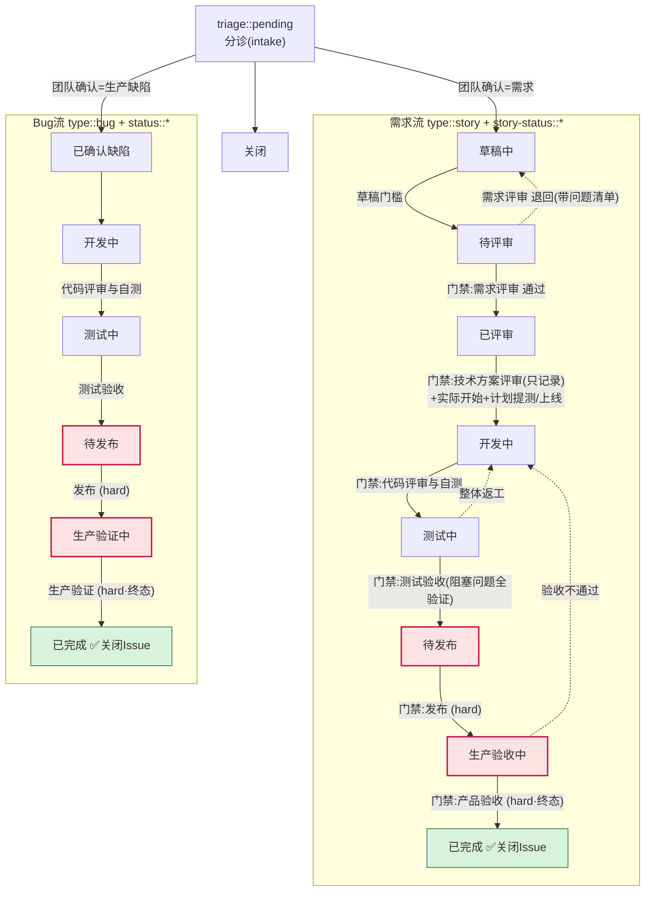
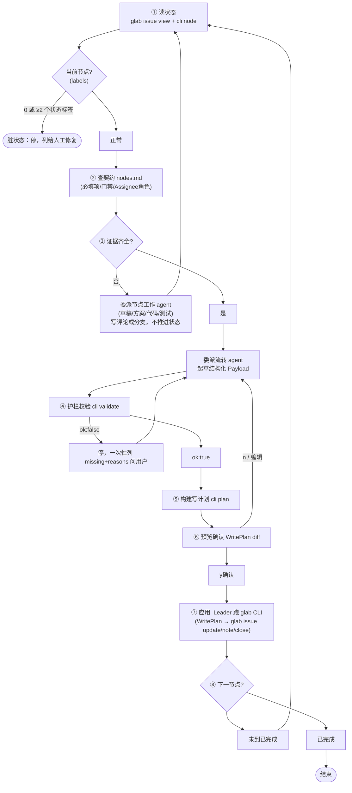
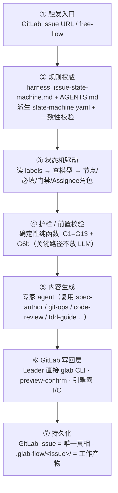

# glab-flow 流程图

> GitLab / GitHub 直接渲染下面的 Mermaid；本地用支持 Mermaid 的 MD 阅读器查看。

## 1. 状态机全流（story + bug + 退回路径）

- 实线 = 正向流转；虚线 = 退回路径。
- `(hard)` = hard_gate，引擎永不自动写，必须人工证据 + humanConfirmed。
- 技术方案评审不通过 **不退回**（停在「已评审」继续完善方案）。
- 测试单问题 **不退回**（挂父需求评论）；仅整体返工才回「开发中」。
- 终态（已完成）= 标签替换 + Assignee + 评论 + 关闭 Issue **同一次操作**。
- 引擎只产出节点/校验/计划/渲染结果；GitLab 写回由 Leader 预览后用已认证的 `glab` CLI 执行。

## 2. Leader 每轮编排（8 步）

## 3. 七层架构

## 4. 护栏速查（G1–G13 + G6b）

| 门禁类 | 规则 |
|---|---|
| **流转前置** | G1 必填字段齐全 · G2 门禁二值(通过/退回) · G3 hard_gate 需 humanConfirmed · G4 三类评审分离 |
| **事实/标签** | G5 标签唯一(脏状态拒绝) · G6 Assignee 是具体 @用户 · **G6b 有交付协同表时校验角色匹配** |
| **不臆造** | G9 禁「待确认」占位 · G10 日期需 datesConfirmed |
| **写计划** | G7 不改原文 · G8 不编评论 · G12 终态原子(标签+Assignee+评论+关闭同次) · G13 不建 Jira |
| **发布门** | G11 阻塞发布问题全验证才放行(需求+Bug) |

> 引擎权威来源：`engine/state-machine.yaml`（模型）+ `engine/src/guard.ts`（护栏）。规则与 harness 文档漂移由 `engine/src/contract.ts` 检测。
