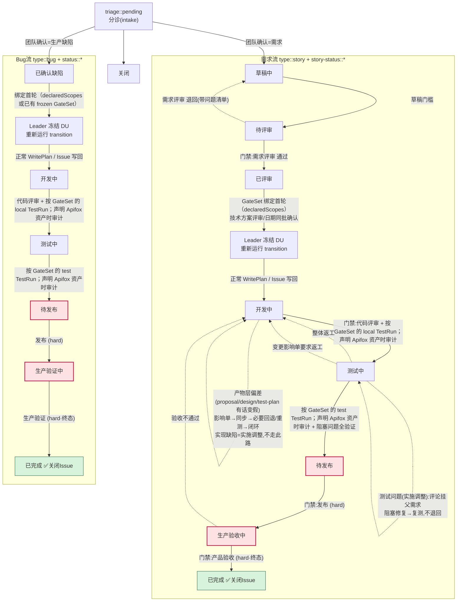
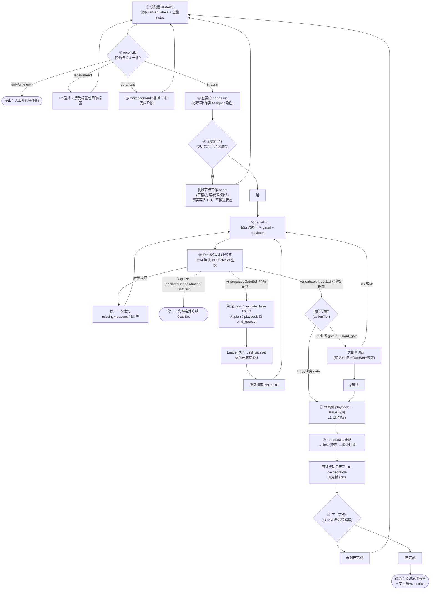
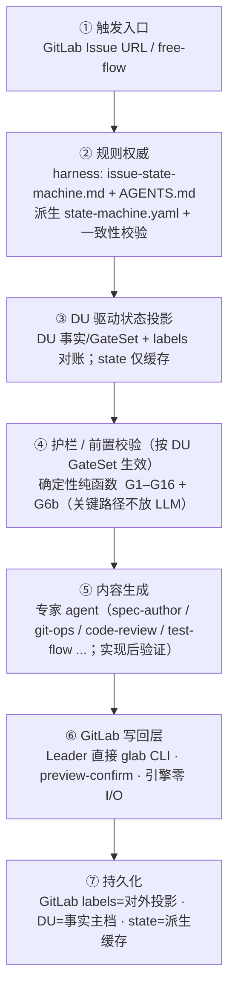

# glab-flow 流程图

**Last Updated:** 2026-09-02

> GitLab / GitHub 直接渲染下面的 Mermaid；本地用支持 Mermaid 的 MD 阅读器查看。

## 1. 状态机全流（story + bug + 退回路径）



- 实线 = 正向流转；虚线 = 退回路径。
- `(hard)` = hard_gate，恒 L3 动作分层；生产部署和终态关闭必须人工证据 + `humanConfirmed`，引擎永不自动写。
- GitLab labels 是对外状态投影；DU 是执行事实、GateSet、资源、指标和 `cachedNode` 的主档，state 只是缓存。每次写回前都先读 GitLab + DU 并 `reconcile`，不得用缓存直接覆盖标签。
- 需求评审先澄清真实用户诉求，再输出评审意见；若有更优方案或交互优化，单独反馈给提单人并记录采纳/不采纳/暂缓。采纳项进入 proposal/design/test-plan，未采纳或暂缓不阻塞通过。
- GateSet `skipStates` 命中的节点只做一层跳状态投影（如 frontend-copy 直推待发布）；`next`、标签和评论头使用最终目标，但校验仍按原转换 fail-closed，不能借跳状态绕过 hard_gate。
- 技术方案评审不通过 **不退回**（停在「已评审」继续完善方案）。
- 测试单问题 **不退回**（挂父需求评论）；仅整体返工才回「开发中」。
- 终态（已完成）= 标签替换 + Assignee + 评论 + 关闭 Issue **同一次操作**。
- 引擎只产出节点/校验/计划/渲染结果；GitLab 写回由 Leader 预览后用已认证的 `glab` CLI 执行。

## 2. Leader 每轮编排（8 步）



- 确认与否由**动作分层**决定：L1（gate=null）自动执行；L2（业务 gate）一次批量确认；L3（hard_gate）恒人工（G3）。`run_mode` 只作审计记录。
- 每轮先用 GitLab 最新 labels/notes 与 DU 做 `reconcile`，对账未完成不得写回；`label-ahead` 必须 L2 选择，`du-ahead` 按 `writebackAudit` 只补首个未完成阶段。
- `已评审→开发中`（Story）和 `已确认缺陷→开发中`（Bug）是 GateSet 绑定边界。Story 可由 `declaredScopes` 提案；Bug 必须提供非空 `declaredScopes`，或已有 frozen GateSet，否则停止。绑定首轮只负责 Leader 执行 `bind_gateset` 并落盘冻结 DU，不写 Issue 状态；Bug 在有 `declaredScopes` 但 DU 未冻结时明确返回 `validate.ok=false`、`plan` 未定义且 playbook 不含 `issue_writeback`。DU 落盘后重新运行 transition，才生成正常 `WritePlan` 与 Issue 写回/最终回读；冻结后不允许静默重绑，只能通过 `change` 棘轮扩容或显式改判留痕。
- GateSet 的逻辑环境当前仅为 `local` / `test`。只有启用环境缺少 TestRun、或计划声明 Apifox 资产但缺少 AssetAudit（或 full 回归证据）时才发出回归动作；动作按 test-plan 声明的方法执行，完成后记录 DU 证据并重新运行 transition。提测时 local 回归位于 feature commit 之后、merge/deploy 之前。
- 生产 GateSet 要求回滚方案时，playbook 发出 `verify_rollback_ready` 核对已生成且已回读的方案；`release-check` 仍在测试验收阶段生成 `release-plan`，发布阶段不重新生成。
- GateSet.skipStates 命中的节点只投影一层，`next`/标签/评论头使用最终目标，校验仍按原转换 fail-closed，并额外执行投影后的 hard gate 校验；不得借跳状态绕过 hard_gate。
- Issue 写回完成并最终回读成功后，Leader 必须调 `pnpm cli du` 的 `cached-node` 更新 DU 对账基准，再更新 state。
- `proposal.md` / `design.md` / `test-plan.md` 按 `skills/glab-flow/artifact-quality.md` 形成同一条可追溯链路：需求目标与 AC → 设计决策、风险和影响范围 → case、环境、测试数据和证据。只有需求复述、文件清单或临场测试说明的产物视为未完成。

## 3. 七层架构



## 4. 护栏速查（G1–G16 + G6b）

| 门禁类 | 规则 |
|---|---|
| **流转前置** | G1 必填字段齐全 · G2 门禁二值(通过/退回) · G3 hard_gate 需 humanConfirmed · G4 三类评审分离 |
| **事实/标签** | G5 标签唯一(脏状态拒绝) · G6 Assignee 是具体 @用户 · **G6b 有交付协同表时校验角色匹配** |
| **不臆造** | G9 禁「待确认」占位 · G10 日期需 datesConfirmed |
| **写计划** | G7 不改原文 · G8 不编评论 · G12 终态原子(标签+Assignee+评论+关闭同次) · G13 不建 Jira |
| **发布门** | G11 阻塞发布问题全验证才放行(需求+Bug；仅进入过测试环境的路线) · G14 feature→master 发布 MR 评审前置(测试中→待发布 只打开/确认 MR，不合并 master；无 CRITICAL/HIGH 残留才放行；仅 DU GateSet `mrReview=true` 时必填) |
| **变更闭环** | G16 未关闭的变更影响单阻断正向流转；变化分级 T1–T4（`change` 自动定级+GateSet 棘轮扩容），T3+ 测试计划受影响时必须版本递增并按影响范围重跑相关环境 |

> 引擎权威来源：`engine/state-machine.yaml`（模型）+ `engine/src/guard.ts`（护栏）。规则与 harness 文档漂移由 `engine/src/contract.ts` 检测。

## 5. 多环境测试证据链

```text
TestPlan（逻辑环境）
  → test-config --env（脚本 root/env 文件/变量 + 可选 Apifox 环境）
  → data-prep / seed / fixture（真实命名 + 当前环境数据库核对）
  → 脚本 runner / Apifox CLI -e（目标环境）
  → Report environmentName 或命令摘要（实际运行）
  → AssetAudit v2（仅声明 Apifox 资产时：展示 + AuthProfile）
  → TestRun（状态门禁）
```

- 环境事实任一不一致即停止：例如脚本变量指向 local 但计划跑 test，或 Stage 入口的 Apifox 页面列显示 local。
- 数据准备任一不一致即停止：`data-prep:`、`testData.seedFiles`、数据库引用、数据前缀、账号和真实命名必须在执行前核对完成；可复用数据保留或升级共享资产。
- 测试中→待发布 的 `回归范围或证据` 必须列出本轮测试用例/场景和执行证据；`测试环境数据清单` 必须按这些测试用例/场景逐行对齐。若证据中使用 TC-/TP-/CASE- 编号，数据清单必须复用相同编号逐项列出 test 环境使用/产生的数据、关键业务键、来源与保留/清理策略，供人工页面核对或查库。
- 场景步骤、套件成员与数据集优先复用；跨环境只有配置差异时使用场景实例或环境入口，不复制完整流程。
- 登录是可复用 AuthProfile：运行时变量注入账号密码，登录后置提取临时 token，业务接口统一引用鉴权变量；401/403 不静默重试。
