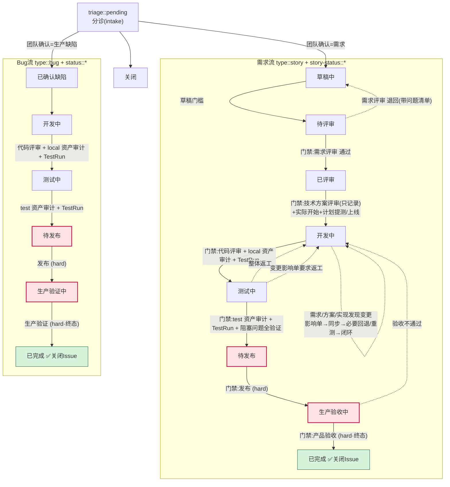
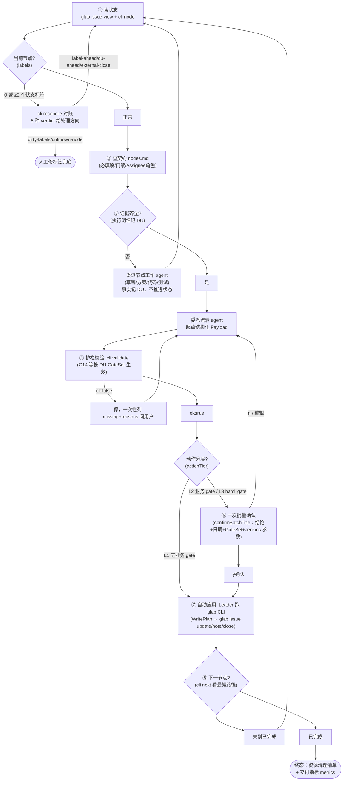
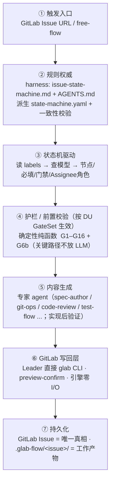

# glab-flow 流程图

> GitLab / GitHub 直接渲染下面的 Mermaid；本地用支持 Mermaid 的 MD 阅读器查看。

## 1. 状态机全流（story + bug + 退回路径）



- 实线 = 正向流转；虚线 = 退回路径。
- `(hard)` = hard_gate，恒 L3 动作分层，引擎永不自动写，必须人工证据 + humanConfirmed。
- GateSet `skipStates` 命中的节点被跳状态投影（如 frontend-copy 直推待发布）；校验仍按原转换 fail-closed。
- 技术方案评审不通过 **不退回**（停在「已评审」继续完善方案）。
- 测试单问题 **不退回**（挂父需求评论）；仅整体返工才回「开发中」。
- 终态（已完成）= 标签替换 + Assignee + 评论 + 关闭 Issue **同一次操作**。
- 引擎只产出节点/校验/计划/渲染结果；GitLab 写回由 Leader 预览后用已认证的 `glab` CLI 执行。

## 2. Leader 每轮编排（8 步）



- 确认与否由**动作分层**决定：L1（gate=null）自动执行；L2（业务 gate）一次批量确认；L3（hard_gate）恒人工（G3）。`run_mode` 只作审计记录。
- `已评审→开发中` 的 `declaredScopes` → `proposedGateSet` 与计划日期同一次 L2 确认后冻结进 DU；GateSet.skipStates 命中的节点直接投影到下一节点（校验仍按原转换 fail-closed）。

## 3. 七层架构



## 4. 护栏速查（G1–G16 + G6b）

| 门禁类 | 规则 |
|---|---|
| **流转前置** | G1 必填字段齐全 · G2 门禁二值(通过/退回) · G3 hard_gate 需 humanConfirmed · G4 三类评审分离 |
| **事实/标签** | G5 标签唯一(脏状态拒绝) · G6 Assignee 是具体 @用户 · **G6b 有交付协同表时校验角色匹配** |
| **不臆造** | G9 禁「待确认」占位 · G10 日期需 datesConfirmed |
| **写计划** | G7 不改原文 · G8 不编评论 · G12 终态原子(标签+Assignee+评论+关闭同次) · G13 不建 Jira |
| **发布门** | G11 阻塞发布问题全验证才放行(需求+Bug；仅进入过测试环境的路线) · G14 feature→master MR 评审前置(无 CRITICAL/HIGH 残留才放行；仅 DU GateSet `mrReview=true` 时必填) |
| **变更闭环** | G16 未关闭的变更影响单阻断正向流转；变化分级 T1–T4（`change` 自动定级+GateSet 棘轮扩容），T3+ 测试计划受影响时必须版本递增并按影响范围重跑相关环境 |

> 引擎权威来源：`engine/state-machine.yaml`（模型）+ `engine/src/guard.ts`（护栏）。规则与 harness 文档漂移由 `engine/src/contract.ts` 检测。

## 5. 多环境 Apifox 证据链

```text
TestPlan（逻辑环境）
  → Apifox CLI -e（目标环境）
  → Report environmentName（实际运行）
  → Apifox 列表/详情（用户可见投影）
  → AssetAudit v2（展示 + AuthProfile）
  → TestRun（状态门禁）
```

- 四层任一不一致即停止：例如 Stage 入口的页面列显示 local，或报告环境与计划入口不符。
- 场景步骤、套件成员与数据集优先复用；跨环境只有配置差异时使用场景实例或环境入口，不复制完整流程。
- 登录是可复用 AuthProfile：运行时变量注入账号密码，登录后置提取临时 token，业务接口统一引用鉴权变量；401/403 不静默重试。
