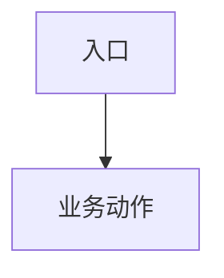
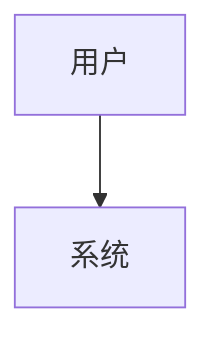

> 本文件是 glab-flow 自有子 skill（vendor 自 `~/.claude/skills/spec-author` 并按 GitLab-native 适配）。在对应节点由 Leader Read 本文件内联执行，或 spawn `general-purpose` 以其为 prompt。运行时工具依赖见 `../tools.md`。

# Spec-Author：需求 → 结构化 spec

把需求转成工程级的 `proposal.md` + `design.md`，让开发者无需猜测就能实现。

## 工具使用

你已安装的全部 skill / agent 都可用，主动调用（未装时降级为代码扫描 + 推理）：
- 接口设计 → api-design
- 架构/画图 → architect / architecture-diagram
- 查代码 → codegraph / code-explorer / repo-scan
- 各栈规范 → 对应 *-coding-standards（作风格权威参考）

## 输入

- GitLab Issue `<iid>`（Leader 已通过 glab CLI 读取 Issue 描述与评论）或自然语言 `{requirement_text}`
- 触发条件集：由编排器传入，或从代码扫描自检（见下「触发条件映射」）

## 产出

工作产物落点见 `../nodes.md`：所有 spec 文档统一落在 `<workspace.root>/.glab-flow/<iid>/spec/`（**禁止**写进代码仓的 `docs/`）。

- `<workspace.root>/.glab-flow/<iid>/spec/proposal.md`
- `<workspace.root>/.glab-flow/<iid>/spec/design.md`
- 向 Leader 返回：`spec_name`、简短摘要、使用的触发集（产出目录以 `<iid>` 为准）

质量权威见 `../artifact-quality.md`。本子 skill 产出的 `proposal.md` / `design.md` 必须先满足该标准，再进入节点评论摘要；不能只生成“文件清单式方案”或“需求原文整理版 PRD”。

## 产出落点与数据型需求

产出落 `.glab-flow/<iid>/spec/`（本地工作副本）；**需求提案要点 / 技术方案**的内容写进节点合并评论（见 `../nodes.md`「节点内容评论」），团队在 Issue 上看得到。此子 skill 只负责产物及评论摘要，GitLab 写回由 Leader 执行。

数据型需求（涉及库存/金额/统计等数据流）：architect 在技术方案里写清**代码数据流**、数据源/真理源决策；如需求要求验证生产历史/现状，还要写入**只读生产取证**结果与使用的路由、权限或脱敏约束。证据不可得时报告缺口，不能以推测补足。

## 驱动的 agent

编排器 spawn 本 skill 的 agent：requirements-analyst（核心章节 + 澄清）→ architect（工程章节 + 架构决策）。角色专长由本文件的 prompt 内容注入给被 spawn 的 agent，**不读** `~/.claude/agents/*.md`——即 glab-flow 自包含，不依赖全局 agent 定义。

## 流程

1. requirements-analyst：读 GitLab Issue/需求 + 相关代码 + Issue 正文/评论内全部图片 → OCR 与视觉核查后写**核心章节** → 仅在歧义时问澄清。图片不可下载、OCR 不可确认或视觉语义不清时，必须进入同批澄清问题，不能跳过。真实诉求已理解且同批追问补齐后，如发现更低成本、更低风险或更好的交互设计，单独形成「改进建议 / 交互优化反馈」给提单人裁定。
2. **若需求指向具体页面/URL**：先做「路由分流核查」（见下），确认这个 URL 实际会渲染哪些组件，再进入触发检测和后续分析——不要 grep 到第一个文件名相似的组件就当唯一实现。
3. 检测触发条件（见「触发条件映射」）。
4. architect：写**触发的工程章节** + 架构决策 + 关键文件 + 复用点。
5. 按 Gate 1 checklist 自检；补齐缺口后再汇报。

### 设计前 grilling（architect 写 design.md 前必做，防「产品没想的」漏到提测）

**优先调用 `grill-me` skill** 执行本节（材料 = 需求草稿 + 已触发工程章节 + 你的代码自查证据；覆盖清单在五类底线上按必问分支扩展）。它保证铁律：一次问全（绝不挤牙膏）、下游决策条件式默认裁定、事实自查不问能查到的、每题附推荐。skill 不可用时按下列铁律手工执行，产出等价：

- **一次问全**：把当前能确定的全部设计问题**一条消息/评论问完**（每题编号 + **附推荐答案**，用户确认/否决即可）。**绝不**先问两三个、等回答后再追问新的。
- **条件式默认裁定**：依赖未回答前提的下游决策，自拟默认写成「若 Q2 答 A，则按〈默认〉处理」放进同一批——用户答完默认自动生效或被推翻，不产生第二轮追问。
- **事实自查**：现有数据结构、既有实现、配置机制、路由分流这类环境事实由你用 codegraph/源码/Grep 查——**永远不问用户你能自己查到的东西**；查不到才列为待确认问题。
- **必问分支**（按触发的工程章节挖）：数据模型（字段类型/可空/精度/币种）、API 契约（错误码全集/分页/幂等）、边界（并发/越权/大数量/特殊字符）、回滚（migration 可逆性/数据兼容）、多端分流（同一路由多套实现是否都覆盖）。
- **开写条件**：每个分支要么有答案、要么有条件式默认裁定——满足即写 design.md，不等所有回答到齐（默认裁定可先行落方案）。追问及结论记入 design.md「设计决策」小节（每条：问题 → 推荐 → 用户裁定/默认），评审可追溯；用户后续推翻默认时按变更处理，不算追问失败。
- **改进建议边界**：更优方案/交互优化必须基于已澄清诉求和代码事实，按「建议类型 → 建议内容 → 依据 → 预期收益 → 影响范围 → 默认推荐 → 提单人反馈结论」记录。它不是阻塞问题；提单人采纳才写入 proposal/design/test-plan，不采纳或暂缓只留评审记录。若采纳会改变已确认产物，走变更影响单。

### 路由分流核查（拿到具体 URL 时必做）

同一个 URL 背后可能不止一套实现——按设备（User-Agent 检测，如 `react-device-detect`）、租户、灰度开关、版本号等分流到不同的组件是常见模式，不能假设"一个路径 = 一份代码"。

1. 在前端路由注册处（如 `routers/index.tsx`）搜这个路径，看注册项是否同时挂了多个组件（例如同一路由对象里有 `web:` 和 `mobile:` 两个字段）。
2. 若命中多套实现，逐一确认：状态判断逻辑是否一致、提交/展示字段是否一致——**不要只改其中一套就当作完成**，除非需求明确只针对某一端。
3. 把核查结论写进 design.md「关键文件」章节：列出所有命中的实现文件，以及分流依据（User-Agent / 租户 / 灰度等）。
4. 同时写入 proposal.md「需求评审取证」：用户描述位置、代码确认的实际 URL、路由文件、组件文件和分流条件。找不到或有多个候选时写明候选与代码证据，生成一条要求产品确认的评审问题；禁止猜测 URL。
5. 后端同理：确认该功能是否有多个入口/版本（如 v1/v2 并存的旧接口），避免只改一半。

## proposal.md 核心章节（恒必填）

- **需求背景与目标** —— 业务痛点、影响对象、为什么现在做、可验证业务结果；没有量化指标时写可判断的业务结果
- **应用范围** —— Web/H5/iOS/Android/后端接口/定时任务/消息等是否涉及，未涉及写依据
- **用户范围与权限** —— 角色定义、数据范围、操作权限矩阵；有角色差异必须表格化
- **业务流程与状态** —— 主流程图/状态表；复杂跨角色/跨系统/状态流转必须用 Mermaid 或表格
- **功能详细说明** —— 入口、触发条件、字段定义、校验规则、展示规则、交互反馈、提示语
- **范围** —— 明确 in / out；P0/P1 本次交付，P2 默认范围外，除非用户明确纳入
- **边界条件与异常处理** —— 空数据、超长内容、重复点击、并发、权限变化、状态已变、外部依赖失败
- **非功能需求** —— 性能、安全/脱敏/越权、数据兼容、可用性、审计日志；只在命中时展开，不涉及写判断依据
- **埋点与统计** —— 事件、触发时机、属性、用途；无需求写“不涉及 + 原因”
- **验收标准** —— 每个场景 Given/When/Then，且每条 AC 后续必须映射到 test-plan case
- **影响模块** —— 每个影响模块说明改动性质和关联目标
- **上线步骤与配置清单** —— 区分 A 类（随代码部署生效：migration、init 命令、随版本配置）与 B 类（各环境手动配置：菜单/权限/开关）。**先核查配置机制**（查模块 `config/*.php` + 平台 init 命令），不能臆测某项是「手动」还是「自动同步」——配置类型误判是发布现场常见返工点。
- **需求评审问题与裁定** —— 问题、推荐方案、用户/产品裁定、影响章节；不能把未决问题包装成已确认规则
- **需求评审改进建议** —— 无建议填“无”；有建议时写清类型、内容、依据、收益、影响范围和提单人反馈结论。采纳项同步到范围/验收/设计/测试策略；不采纳或暂缓项不阻塞。

## 触发条件映射

核心章节恒必填。下列工程章节**仅在对应触发条件命中时**展开。编排器传入触发集；缺省时由 architect 从代码扫描检测。

| 触发条件 | 展开章节 | 必填内容 |
|---|---|---|
| 新表 / 字段变更 / migration | 数据模型 | 表结构、字段、索引、migration 步骤 |
| 新增或改动端点 / 请求-响应 | API 契约 | endpoint、请求/响应结构、错误码 |
| 跨模块 / 跨服务改动 | 接口边界 | 模块间契约、调用方向 |
| 状态机 / 多步工作流 / 异步 | 状态与流程 | 状态机或时序图 |
| 重要错误路径 / 权限 / 支付 | 错误契约 | 异常分类、降级、权限矩阵 |
| （恒久；深度可缩放） | 测试策略 | 每条验收标准怎么测 |

### 触发条件检测提示

- **数据模型**：引用了 migration 文件、描述里出现新字段、"新增表/字段"。
- **API 契约**："接口/endpoint/请求/响应"、路由变更。
- **接口边界**：影响模块多于一个模块/服务。
- **状态与流程**：状态字段、工作流、"审批/流转"、异步任务。
- **错误契约**：权限规则、支付、文件上传、外部服务调用。

### 扩展

项目专属触发条件可按相同结构（触发名 → 必填章节 + 内容 checklist）在 glab-flow 配置中扩展；缺省时由 architect 从代码扫描检测。测试策略恒必填（深度随复杂度变化）。

## design.md 核心章节（按复杂度展开）

- **背景与目标摘要** —— 摘要 proposal 的 Why/What，不重复整份 PRD；明确非目标
- **总体设计** —— 方案概述、系统上下文/架构图、核心链路流程图/时序图；跨系统/状态/异步/发布顺序命中时必须画 Mermaid
- **架构决策** —— 复杂需求强制非空（格式：决策 / 理由 / 备选方案 / 影响）
- **关键文件与改动** —— 每个文件写“改什么、为什么、影响范围、关联 AC”
- **复用点** —— 先找现有实现来复用/扩展
- **存储/数据设计** —— 命中数据库、缓存、配置、历史数据时必填：表、字段、索引、migration、缓存 key/TTL/更新策略、兼容与回滚
- **API/接口契约** —— 命中接口时必填：endpoint、入参、出参、错误码、幂等、分页、鉴权
- **核心业务规则/状态机** —— 命中复杂规则、审批、状态流转、异步任务时必填：流程图/状态表/补偿策略
- **权限与安全** —— 命中角色、菜单、数据权限、敏感字段时必填：权限矩阵、脱敏、越权防控
- **非功能与风险** —— 性能/容量、一致性/并发/幂等、兼容/迁移、降级/故障预案；不涉及写依据
- **可观测性** —— 命中生产风险、异步链路、外部依赖、关键交易链路时必填：日志、指标、告警、排查入口
- **实施与发布方案** —— 实施顺序、A/B 配置清单、发布顺序、回滚方案；不引入 milestone/周排期
- **测试策略输入** —— AC、风险点、建议测试方式、需要的数据，供 test-plan 逐项消费

## 澄清（取代固定 checkpoint）

仅在需求**确实歧义**时才问澄清——不是固定的 3-checkpoint 仪式。用户确认集中在 Gate 1 一次。

## Gate 1（checklist，不打分）

- [ ] 所有核心章节存在且填写完整
- [ ] 已按 `../artifact-quality.md` 自检：proposal/design/test-plan 职责边界清楚，没有互相复制大段内容
- [ ] proposal 覆盖背景目标、应用范围、角色权限、业务流程/状态、功能细则、边界异常、非功能/埋点命中判断和可测试 AC
- [ ] design 覆盖总体设计、架构决策、关键文件与改动、命中条件详细设计、风险/回滚/可观测性和测试策略输入
- [ ] 上线步骤与配置清单存在（A/B 分类，每项配置机制已核查、非臆测）
- [ ] 范围最小性：每个影响模块/AC 都能追溯到一条需求目标；疑似附带的字段/参考价/预留开关已用代码证据核实是否有依赖，无依赖的精简掉（防过度设计）
- [ ] 所有模糊词（尽量/适当/相关/优化一下/保持一致）都已改成明确条件、规则、阈值、提示语或验收方式
- [ ] 需求指向具体 URL 时，已做路由分流核查（多套实现均已列出或已确认只有一套）
- [ ] 设计前 grilling 已一次问全：设计决策含「问题 → 推荐 → 用户裁定/条件式默认」记录，每个分支有答案或有默认裁定
- [ ] 如提出更优方案/交互优化，已记录提单人采纳/不采纳/暂缓；采纳项已反映到 proposal/design/test-plan，不采纳/暂缓项未被当作阻塞项
- [ ] 所有触发的工程章节存在且填写完整
- [ ] 无 TBD/TODO；模板里的 `<...>` 指导占位**必须全部替换为真实内容**（不允许保留 `<...>`）
- [ ] 每条验收标准有对应的测试策略条目
- [ ] 复杂需求：架构决策非空

pass/fail。无数字分数。无自评循环。

## 模板（中文骨架）

### proposal.md

```
# Proposal: <iid>

> 由 spec-author 生成（中文）。核心章节必填；条件章节按触发集追加。

## 背景与目标
<问题、为何现在做、成功指标>

## 应用范围
| 端 / 系统 | 是否涉及 | 判断依据 |
|---|---|---|
| Web/H5/iOS/Android/后端接口/定时任务/消息 | <是/否> | <依据> |

## 用户范围与权限
| 角色 | 使用场景 | 数据范围 | 可操作项 |
|---|---|---|---|
| <角色> | <场景> | <范围> | <查看/新增/编辑/删除/...> |

## 业务流程与状态


## 范围
### 范围内
- <项>
### 范围外
- <项>

## 验收标准
- **AC1**：给定 <上下文>，当 <动作>，则 <预期>
- **AC2**：...

## 边界条件与异常处理
| 场景 | 条件 | 期望行为 | 提示/兜底 | 是否纳入验收 |
|---|---|---|---|---|
| 空数据/超长/重复点击/权限变化/状态已变/外部依赖失败 | <条件> | <行为> | <提示> | <是/否+依据> |

## 非功能需求与埋点
| 维度 | 是否涉及 | 要求 | 验收方式 |
|---|---|---|---|
| 性能/安全/兼容/可用性/审计/埋点 | <是/否> | <要求或不涉及依据> | <方式> |

## 影响模块
- <模块> —— <改动性质>

## 上线步骤与配置清单
### A 类（随代码部署生效）
- <migration / init 命令 / 随版本配置>
### B 类（各环境手动配置）
- <菜单/权限/开关 —— 已核查配置机制：__自动同步(init:__) / __后台手动__>
> 每项标注配置机制来源（查 config/*.php + init 命令确认），不臆测。

## 需求评审改进建议
| 类型 | 建议内容 | 依据 | 预期收益 | 影响范围 | 提单人反馈结论 |
|---|---|---|---|---|---|
| <方案/交互/范围/风险/其他> | <更优方案或交互建议> | <需求诉求与代码/产品依据> | <减少返工/降低风险/提升体验等> | <涉及模块/页面/API/数据> | <采纳/不采纳/暂缓> |
> 无改进建议时填“无”。采纳项必须同步到范围、验收标准、设计决策或测试策略；不采纳/暂缓项不得阻塞通过。

<!-- 条件工程章节按触发条件追加：数据模型 / API 契约 / 接口边界 / 状态与流程 / 错误契约 -->

## 测试策略（必填）
- AC1 → <如何验证> [test_strategy: regression|smoke|contract|manual]
- AC2 → <如何验证> [test_strategy: ...]
```

### design.md

```
# Design: <iid>

## 背景与目标摘要
- 业务背景：
- 技术目标：
- 非目标：

## 总体设计
### 方案概述
### 系统上下文 / 架构图

### 核心链路流程图 / 时序图

## 架构决策（复杂需求强制非空）
| 决策 | 理由 | 备选方案 | 影响 |
|---|---|---|---|
| <决策> | <为何> | <其他方案及为何不选> | <影响范围> |

## 关键文件
| 文件 | 改动内容 | 影响范围 | 关联 AC |
|---|---|---|---|
| <路径> | <此处改动内容> | <模块/接口/页面> | <ACx> |

## 复用点
- <可复用/扩展的现有实现> —— <如何复用>

## 非功能与风险
| 风险 | 触发条件 | 影响 | 预案 | 验证方式 |
|---|---|---|---|---|
| <风险> | <条件> | <影响> | <降级/补偿/回滚> | <测试方式> |

## 可观测性
- 日志：
- 指标：
- 告警：
- 排查入口：

## 实施与发布方案
- 实施顺序：
- 配置清单：A 类 / B 类
- 发布顺序：
- 回滚方案：

## 测试策略输入
| AC | 风险点 | 建议测试方式 | 需要的数据 |
|---|---|---|---|
| AC1 | <风险> | <unit/api/e2e/script/manual> | <数据> |

<!-- 条件工程章节（存储/数据 / API 契约 / 接口边界 / 状态与流程 / 权限安全 / 错误契约）按触发条件展开 -->
```

## Dependencies

- Agents（内嵌）：requirements-analyst、architect
- GitLab：glab CLI（读 Issue / 写评论）—— 由 Leader 持有，见 `../tools.md`
- 探索：方案/决策需头脑风暴时，可 spawn `general-purpose`
